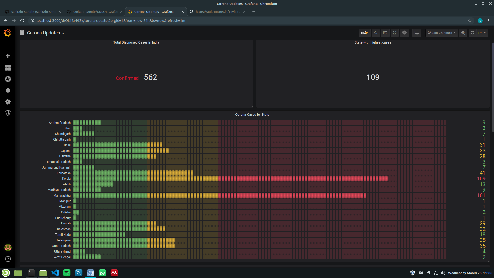
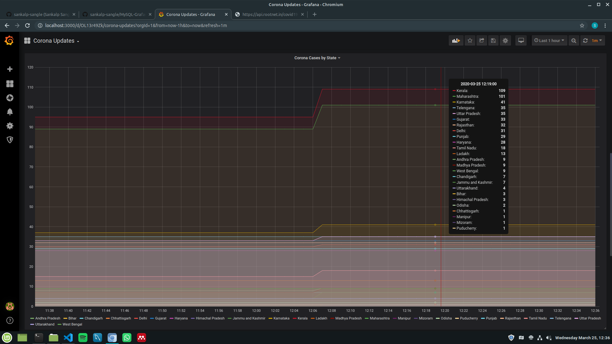

# Corona-Updates

Python custom collector to store Corona updates fetched from an API(https://api.rootnet.in/covid19-in/stats/latest) into Prometheus TSDB.
Will visualize with Grafana. Simple pet project, didn't wish to constantly refer to google for updates on the numbers.
___
Some sample pics of the dashboard are given below:

___
